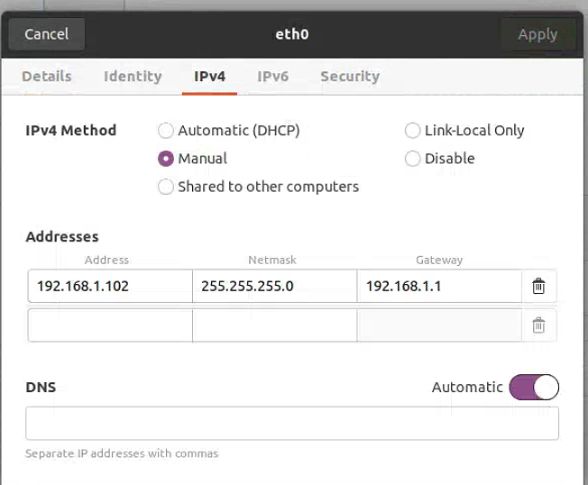
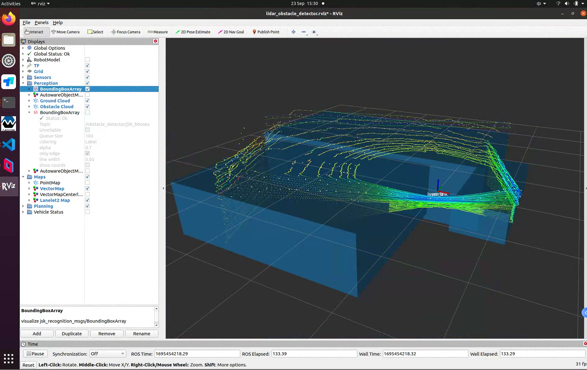

Lidar 3D Object Detection
=============
# 3D object detection using LS 32 line LiDAR (C32-151A)
(PS:镭神32线激光雷达)

###### Upload Log:

Version|Date|Uploaded by 
--|:--:|--:
V1|September 23, 2023|Iris Wei


The file contains:
--------
##### 1. Laser radar drive
##### 2. Clustering target detection code


Change device modification:
--------
##### Modify the network port

  

Run Driver Demo
---------
```
roscore
source devel/setup.bash
roslaunch lslidar_driver lslidar_c32.launch
```

Run the Lidar 3D Object Detection function
---------
```
roscore
source devel/setup.bash
roslaunch lidar_obstacle_detector detect_objects_realtime.launch
```

Function implementation:
--------
##### 1.Receive point cloud data from 3D LiDAR sensors.
##### 2.Perform ground filtering to remove ground points from point cloud data and retain non ground obstacle point clouds.
##### 3.Perform point cloud filtering on the ceiling (or filter out the roof) to filter out points above the specified height from the point cloud data.
##### 4.Perform downsampling, ROI (region of interest) extraction, and roof removal on the remaining point cloud data.
##### 5.Detect the ground by dividing the plane and separate the ground point cloud from the point cloud data.
##### 6.Cluster non ground point clouds and divide point cloud data into different object clusters.
##### 7.Publish ROS messages for processed ground point clouds, non ground point clouds, object clustering information, and other related information.
##### 8.The use of Dynamic Reconfigure allows users to adjust node parameters at runtime, such as filter settings and clustering thresholds.


Existing problems:
--------
##### Poor recognition performance indoors

  

